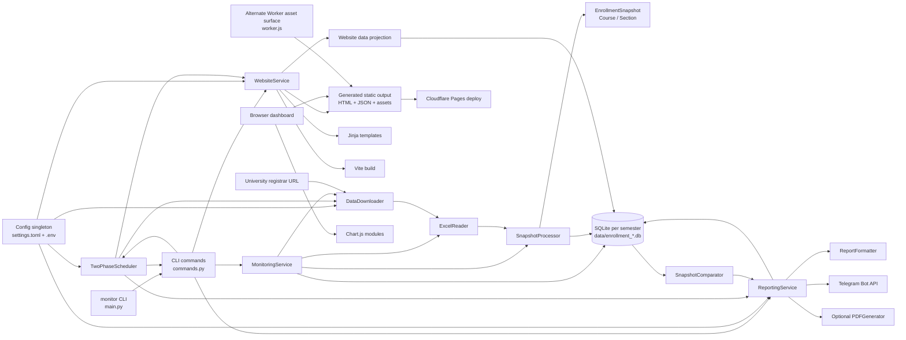

# Architecture discovery — read-only

Scope: repository at `/Users/spook/Documents/Home/01 Active/Personal/Summer2026RegistrarMonitor/registrar_monitor`, HEAD `c660b00`. The worktree already contained a modification to `assets/website/.DS_Store`; I did not alter it. No files were added, removed, or modified during the discovery pass.

## A. Executive summary

This is a modular monolith: one Python application with a CLI, local SQLite persistence, scheduled background processing, report generation, and static website generation. It is not a service collection or conventional monorepo, although `assets/website` is a separately packaged JavaScript build inside the repository.

The primary runtime is Python 3.13, packaged with `uv` and Hatchling. The entry point is the `monitor` console script defined in `pyproject.toml`, which resolves to `registrarmonitor.main:cli_main`. The application uses `argparse`, `asyncio`, `httpx`, `xlrd`, Jinja2, `python-telegram-bot`, SQLite, and FPDF.

Enrollment data is acquired from the university registrar as an Excel file, normalized into `EnrollmentSnapshot`, `Course`, and `Section` models, then stored in one normalized SQLite database per semester. The database is the intended source of truth for normal runtime data, as documented in `README.md` and `AGENTS.md`.

The static dashboard is generated by Python from SQLite data. Python writes HTML, JSON payloads, share pages, headers, and robots metadata; Vite builds the browser JavaScript and CSS into hashed assets. The browser has no backend API: it loads static HTML and then fetches a generated JSON payload.

Operational complexity is concentrated in orchestration. The same business activities can be reached through `monitor poll`, `monitor report`, `monitor run`, `monitor schedule`, cron-installed stateful reports, and maintenance scripts. The scheduler also calls CLI command objects internally, so the dependency direction is not strictly layered.

There are two deployment surfaces for the website: `WebsiteService.deploy()` invokes `npx wrangler pages deploy`, while `assets/website/package.json` defines a separate `wrangler deploy --assets=public` command and `worker.js` implements an asset-serving Worker. The repository does not establish which surface is canonical.

Testing is split between a substantial Python pytest suite and a small Node test suite. Python tests distinguish unit and integration markers. The JavaScript tests exist under `assets/website/test`, but the GitHub Actions workflow runs website lint and build only, not `npm test`.

The dashboard has no application-level authentication or authorization. It is designed as a public static site. Telegram and Cloudflare credentials are deployment/integration credentials loaded from environment variables, not user-session credentials.

## B. Repository map

| Area | Role | Important paths |
|---|---|---|
| Python package | Main application and domain logic | `/Users/spook/Documents/Home/01 Active/Personal/Summer2026RegistrarMonitor/registrar_monitor/src/registrarmonitor` |
| CLI | Public operator interface | `src/registrarmonitor/main.py`, `src/registrarmonitor/cli/commands.py` |
| Automation | Downloading and adaptive scheduling | `src/registrarmonitor/automation` |
| Data layer | Excel parsing, normalization, SQLite, comparison, migration | `src/registrarmonitor/data` |
| Models | Enrollment domain objects and comparison DTOs | `src/registrarmonitor/models.py` |
| Services | Workflow orchestration | `src/registrarmonitor/services` |
| Reporting | Text, Telegram, and optional PDF output | `src/registrarmonitor/reporting` |
| Website generator | SQLite-to-static-site projection | `src/registrarmonitor/website`, `src/registrarmonitor/services/website_service.py` |
| Browser application | Vanilla JavaScript dashboard and charts | `assets/website/src/main.js`, `chartMapping.mjs`, `urlSlugs.mjs` |
| HTML templates | Jinja2 page and share-page templates | `src/registrarmonitor/website/templates` |
| Maintenance scripts | Database administration, migration, benchmarks, VPS/cron setup | `scripts` |
| Python tests | Unit and SQLite-backed tests | `tests` |
| JavaScript tests | Node built-in tests for browser helpers | `assets/website/test` |
| Configuration | Runtime settings and secrets interface | `settings.toml`, `.env.example`, `src/registrarmonitor/config.py` |
| CI | Python checks and website lint/build | `.github/workflows/ci.yml` |
| Packaging/tooling | Python and JavaScript dependency locks | `pyproject.toml`, `uv.lock`, `assets/website/package.json`, `package-lock.json` |
| Runtime/generated state | Local databases, downloads, logs, generated website | `data/`, `assets/downloads/`, `assets/changes/`, `assets/website/public/`, `logs/` |

The source structure is a modular monolith with a nested static frontend, not a multi-service deployment.

## C. Component inventory

| Component | Responsibility and interface | Inbound dependencies | Outbound dependencies / integrations | Owned state | Confidence |
|---|---|---|---|---|---|
| CLI entry point | Parses commands and dispatches async handlers through `create_parser()`, `async_main()`, and `cli_main()` in `main.py` | Installed `monitor` command | CLI command classes, logging, asyncio | Process exit status | High |
| CLI commands | Implements `poll`, `report`, `run`, `schedule`, `deploy`, `status`, and database commands | `main.py`, shell scripts, operators | Services, database classes, scheduler, instructor population | Command-level workflow state | High |
| Config/core | Loads `settings.toml`, `.env`, logging, and custom exceptions | Nearly every Python component | `toml`, `python-dotenv`, filesystem, Python logging | Config singleton and logging setup flag | High |
| Domain models | Represents `Section`, `Course`, `EnrollmentSnapshot`, and comparison details | Data, reporting, services, tests | Python stdlib only | In-memory enrollment state | High |
| Acquisition | Downloads registrar Excel files | `MonitoringService`, scheduler | Registrar HTTP endpoint through `httpx`; local `.xls` files | Download files in `assets/downloads` | High |
| Parsing/processing | Converts Excel rows into normalized domain models | `MonitoringService` | `xlrd`, instructor normalization, database persistence | Temporary processed snapshot objects | High |
| Database manager | Creates schema, stores/reconstructs snapshots, tracks reporting and instructor changes, performs cleanup | Services, website data, scripts, tests | SQLite files under `data/` | Per-semester SQLite databases | High |
| Monitoring service | Coordinates download, Excel parsing, snapshot processing, reads, comparison inputs, and cleanup | CLI commands, tests | Downloader, reader, processor, database manager | Service-local component references | High |
| Scheduler | Adaptive quiet/burst polling, queued processing, update triggers, decision logging | `ScheduleCommand`, VPS systemd, direct execution | Downloader, `PollCommand`, `ReportingService`, `WebsiteService`, `settings.toml`, `caffeinate` | In-memory mode/counters, JSONL decision log | High for behavior; medium for canonical operation |
| Reporting service | Compares snapshots, writes text reports, optionally sends Telegram, optionally generates PDFs | `ReportCommand`, scheduler, tests | Database manager, comparator, formatter, Telegram, FPDF, filesystem | `reporting_log`, text/PDF files | High |
| Website data projection | Converts SQLite data into browser payloads, histories, event timelines, and minified keys | `WebsiteService`, tests | Direct SQLite queries, milestone config | Generated JSON structures | High |
| Website service | Builds frontend, generates pages and share pages, validates output, optionally deploys | CLI, `run`, scheduler | npm/Vite, Jinja2 templates, checksums, Wrangler/Cloudflare | `assets/website/public` and checksum file | High |
| Browser dashboard | Renders courses, filters, bookmarks, deep links, and charts | Static HTML/JSON from WebsiteService | Browser DOM, `localStorage`, Chart.js plugins | Browser-local bookmarks/chart mode | High |
| Maintenance scripts | Backups, arbitrary SQL, vacuum/export, snapshot reorder, instructor population, benchmarks, VPS/cron setup | Operators | SQLite, filesystem, shell tools | Operational files and database mutations | High |

## D. Runtime and data flows

### 1. Application startup and CLI dispatch

1. The installed `monitor` command enters `registrarmonitor.main:cli_main()` from `pyproject.toml`.
2. `cli_main()` runs `async_main()` via `asyncio.run()` in `src/registrarmonitor/main.py`.
3. `async_main()` builds the `argparse` parser, configures logging, then dispatches to a command handler based on `args.command`.
4. Command classes are exported from `src/registrarmonitor/cli/__init__.py`.
5. Top-level failures are converted into printed errors and exit code `1`; `KeyboardInterrupt` becomes exit code `130`.

### 2. Configuration loading

1. `get_config()` constructs the singleton in `src/registrarmonitor/config.py`.
2. `Config.load_config()` loads `.env`, then parses `settings.toml`.
3. Relative directory values are resolved against the repository root.
4. `TELEGRAM_BOT_TOKEN` and `TELEGRAM_CHAT_ID` override the TOML Telegram values when present.
5. Website configuration separately derives base URL, indexing, milestones, semester slugs, and payload key mappings in `src/registrarmonitor/website/config.py`.

### 3. Polling and snapshot persistence

1. `PollCommand.run_with_result()` detects the active semester using `detect_active_semester()` in `src/registrarmonitor/cli/utils.py`.
2. Detection scans `data/enrollment_*.db` and compares latest snapshot timestamps.
3. Without `--file`, `MonitoringService.download_and_process_latest()` calls `DataDownloader.download()`.
4. `DataDownloader.download()` performs an HTTP GET against the configured registrar URL, writes a unique `.xls` file under `assets/downloads`, and wraps network failures in `FileProcessingError`.
5. `ExcelReader.read_excel_data()` reads the first worksheet with `xlrd`, parses semester/timestamp metadata, normalizes enrollment and capacity, computes fill percentage, and normalizes the Faculty column.
6. `SnapshotProcessor.process_data()` filters to undergraduate rows with positive capacity, groups by course and section, computes aggregate fill values, and creates `EnrollmentSnapshot`, `Course`, and `Section` objects.
7. `SnapshotProcessor.save_snapshot()` selects a semester-specific `DatabaseManager`.
8. `DatabaseManager.store_enrollment_snapshot()` suppresses completely identical consecutive snapshots, otherwise writes the snapshot, courses, sections, and enrollment rows in a transaction.
9. After processing, `PollCommand` calls `populate_instructors()` using the original Excel file. That function directly updates `sections.instructor` and appends changes to `instructor_changes`.
10. `PollCommand` reconstructs the latest two snapshots and calculates a change score used by the scheduler.

Key evidence: `MonitoringService.download_and_process_latest()` and `_process_file()` in `src/registrarmonitor/services/monitoring_service.py`; `DataDownloader.download()`; `ExcelReader.read_excel_data()`; `SnapshotProcessor.process_data()` and `save_snapshot()`; `DatabaseManager.store_enrollment_snapshot()`; `populate_instructors()`.

### 4. Representative browser request

There is no dynamic application request or authenticated API request.

1. A browser requests a generated page such as `summer2026.html` from the static host.
2. The Jinja template places the JSON filename in the HTML body’s `data-json-url` attribute.
3. `initApp()` in `assets/website/src/main.js` fetches that JSON file.
4. The JSON payload contains minified keys such as `cr`, `s`, `h`, `af`, and `sn`.
5. The browser renders the course grid and milestone progress.
6. Chart.js and its annotation/zoom plugins are lazy-loaded only when a chart is displayed.
7. Bookmarks and chart mode are stored in `localStorage`.
8. Course share pages redirect to the semester page with a URL hash.

Evidence: `src/registrarmonitor/website/templates/semester.html.jinja`, `assets/website/src/main.js`, and `assets/website/src/urlSlugs.mjs`.

### 5. Standard reporting flow

1. `ReportCommand.run()` detects the active semester and creates `MonitoringService` and `ReportingService`.
2. The monitoring service reads the latest and previous snapshots.
3. `ReportingService.generate_and_send_reports()` calls `SnapshotComparator.compare_snapshots()`.
4. `ReportFormatter.format_changes_report()` creates an emoji-based text report.
5. The report is written under the configured text-report directory, normally `assets/changes`.
6. If enabled, `TelegramReporter.send_text_report()` sends the report through the Telegram Bot API.
7. `--stateful` uses `reporting_log` to establish a baseline and only processes snapshots newer than the last reported snapshot.

Evidence: `src/registrarmonitor/services/reporting_service.py`, `src/registrarmonitor/data/snapshot_comparator.py`, and `src/registrarmonitor/reporting/telegram_reporter.py`.

### 6. Scheduler flow

1. `ScheduleCommand.run()` creates `TwoPhaseScheduler`.
2. The scheduler reads milestones and deadlines from `settings.toml`.
3. `start()` attempts to launch macOS `caffeinate`, performs an initial poll, initializes reporting state, and starts a FIFO pending-poll processor.
4. The main loop calculates the next interval using quiet/burst mode, decay counters, diurnal caps, and milestone preemption.
5. It launches downloads asynchronously and places download tasks into `pending_polls`.
6. `_process_pending_polls_loop()` awaits each download, then invokes `PollCommand.run_with_result(file_path=...)`.
7. Significant changes trigger background report and website tasks subject to cooldowns.
8. Scheduler decisions are appended as JSON lines to `scheduler_decisions.log`.

Evidence: `src/registrarmonitor/automation/scheduler.py`, especially `TwoPhaseScheduler.start()`, `_process_pending_polls_loop()`, `_check_and_trigger_updates()`, and `get_next_poll_interval()`.

### 7. Website generation and deployment

1. `DeployCommand.run()` calls `WebsiteService.generate()`.
2. Generation skips outside configured registration windows unless `--force` is used.
3. `build_frontend_assets()` runs `npm install` when dependencies appear absent/stale, then `npm run build`.
4. The Vite manifest is used to patch hashed JS/CSS references into existing generated HTML.
5. `get_semester_data()` queries SQLite, builds current state, history, event data, milestone filtering, and minified payloads.
6. Jinja templates generate semester pages and per-course share pages.
7. The service writes `index.html`, `_headers`, `robots.txt`, JSON payloads, and checksum data.
8. `validate_public_output()` checks that the output contains only expected public artifacts.
9. If deployment is requested and generation was not skipped, `WebsiteService.deploy()` invokes `npx wrangler pages deploy public --project-name ...`.
10. Cloudflare credentials are read from `CLOUDFLARE_API_TOKEN` and `CLOUDFLARE_ACCOUNT_ID`.

Evidence: `src/registrarmonitor/services/website_service.py`, `src/registrarmonitor/website/data.py`, and `assets/website/vite.config.js`.

### 8. Error handling

- Domain-specific exceptions are defined in `core/exceptions.py`.
- Data and integration layers generally raise or wrap exceptions.
- Services frequently catch broad exceptions and return `False`, `None`, `{}`, or `[]`.
- The CLI catches broad exceptions at the outer dispatch boundary.
- Logging is configured centrally with console, rotating application, and rotating error logs.
- The scheduler additionally writes JSONL decision records independently of the standard logging system.

## E. Architecture diagram

The `Worker` node is shown as an alternate deployment/runtime surface because `worker.js` and the package `deploy` script exist, while the Python service uses Cloudflare Pages deployment.

## F. Architectural observations

### Confirmed strengths

- SQLite has a normalized schema for courses, sections, snapshots, enrollment rows, reporting logs, and instructor changes.
- Snapshot writes are bulk-oriented and transaction-based.
- Duplicate snapshots are detected by content, not only timestamp.
- Website generation has checksum-based incremental behavior and output validation.
- Services expose recognizable workflow interfaces.
- The Python test suite covers CLI dispatch, data processing, SQLite behavior, scheduler logic, reporting, and website generation.
- The project explicitly keeps secrets in environment variables and generated runtime data outside normal source control.

### Confirmed unusual choices and investigation areas

- `scheduler.py` calls `PollCommand`, which is a CLI-layer object, rather than only calling the monitoring service.
- Change-score logic appears in multiple places: `PollCommand._calculate_change_score()`, scheduler scoring helpers, and scheduler update-trigger logic.
- Instructor data is populated both during snapshot processing and in a second direct SQLite pass through `populate_instructors()`.
- `DatabaseManager` is a large central component covering schema initialization, migrations, persistence, reconstruction, reporting state, cleanup, and history queries.
- `scheduler.py`, `database_manager.py`, `main.js`, `website/data.py`, and `commands.py` are the largest concentration points.
- The repository contains multiple execution modes: long-running scheduler, cron stateful reporting, complete `run`, standalone polling, standalone reporting, and direct maintenance scripts.
- The documented “configurable time zones” and generated `schedule.txt` do not match the visible implementation: scheduler logic uses naive local `datetime.now()` values and reads milestone data from `settings.toml`.
- `get_combined_data()` exists but has no production caller in the tracked source.
- The website package contains both a Cloudflare Pages configuration and an alternate Worker asset deployment script.
- The JavaScript test suite is not invoked by the GitHub Actions workflow.
- Python configuration includes mypy and pyright settings/dependencies, but the active CI/type-check command is `ty`.
- The JavaScript package includes TypeScript as a development dependency, but no TypeScript source or TypeScript build configuration is present.
- The current ignored generated website directory contains `data/*.db` and `logs/*.log` artifacts, despite `validate_public_output()` allowing only specific public directories and files. These are local generated artifacts, not tracked source.
- `WIKI_SCHEMA.md` describes UC Berkeley monitoring while the application documentation and settings describe Nazarbayev University. This is a confirmed documentation-domain discrepancy.
- The README describes `src/registrarmonitor/models/` as a directory, while the implementation uses `src/registrarmonitor/models.py`.

### Strong inferences

- The system is optimized for a personal or small-team deployment on a persistent VPS rather than a horizontally scaled service.
- Per-semester databases provide isolation and simplify historical semester handling.
- The static website avoids maintaining a web backend and reduces runtime infrastructure.
- Lazy Telegram and PDF initialization exists to keep non-notification workflows usable without optional credentials.
- Website payload minification, history compaction, checksum generation, and Node memory limits reflect file-size and low-memory operational constraints.
- JSON model serialization and migration support are compatibility layers from an earlier file-based persistence design.

### Weak inferences

- `worker.js`, the package `deploy` script, `schedule.txt`, `get_combined_data()`, the benchmark scripts, and the unused type-tool configurations may be remnants of earlier approaches, experiments, or operational paths. Repository evidence establishes that they are not part of the primary current path, but not why they remain.
- The cron setup and scheduler may represent competing production strategies rather than intentionally complementary modes.
- The local wiki and agent configuration may be tooling contamination rather than application documentation.

### Unresolved questions

- Which scheduler/reporting/deployment path is actually used in production?
- Whether the generated `public/data` and `public/logs` artifacts are accidental local contamination or expected in some deployment workflow.
- Whether the Worker deployment path is still supported.
- Whether historical JSON files still exist on production systems and require migration compatibility.
- Whether naive local timestamps are acceptable because the deployment host timezone is fixed.

## G. Questions for the next stage

### Product

- Is the dashboard public by design, or should enrollment data be restricted?
- Who consumes Telegram reports?
- Are historical semesters a core product feature or retained only for debugging?
- Which enrollment changes are materially important: enrollment counts, capacities, instructors, course additions/removals, or all of them?
- Is course-level “filled” status defined by any section type being full, as implemented?

### Operational

- Is the canonical runtime `monitor schedule`, cron plus `monitor report --stateful`, or another process?
- What are the required polling, reporting, and deployment guarantees?
- What happens when the registrar endpoint is unavailable for several hours?
- Who owns SQLite backups, retention, and snapshot cleanup?
- Is Cloudflare deployment manual, scheduler-triggered, or externally automated?
- What is the expected restart and recovery behavior on the VPS?

### Security

- Is public access to all semester payloads acceptable?
- Could generated DB/log files ever be deployed publicly?
- Is `httpx.AsyncClient(verify=False)` an accepted operational constraint for the registrar endpoint?
- What are the Telegram chat privacy and credential-rotation requirements?
- Who can execute maintenance scripts that run arbitrary SQL or replace databases?

### Scale and performance

- How many semesters, snapshots, courses, and sections exist in production?
- How large are generated JSON payloads and course-share-page sets?
- How long do SQLite queries and website builds take at peak history size?
- Can multiple poll/download tasks overlap in production?
- How much disk growth is acceptable for downloaded Excel files, reports, logs, and snapshots?

### Organizational and workflow

- Which tool is authoritative for Python type checking: `ty`, mypy, or pyright?
- Is the Node test suite expected to be a CI gate?
- Is the Cloudflare Pages path or Worker path the supported deployment mechanism?
- Are `AGENTS.md`, `.wiki`, `WIKI_SCHEMA.md`, and local agent/tool directories maintained as part of the project?
- Are the current documentation discrepancies intentional?
- Are the maintenance and benchmark scripts still operationally required?

## H. Evidence index

| Conclusion | Supporting evidence |
|---|---|
| Python console application | `pyproject.toml`, `src/registrarmonitor/main.py` |
| Nested Vite frontend | `assets/website/package.json`, `assets/website/vite.config.js` |
| SQLite per-semester persistence | `src/registrarmonitor/data/database_manager.py`, `DATABASE.md` |
| Registrar download flow | `src/registrarmonitor/automation/downloader.py`, `settings.toml` |
| Excel-to-model pipeline | `src/registrarmonitor/data/excel_reader.py`, `src/registrarmonitor/data/snapshot_processor.py` |
| Report and Telegram flow | `src/registrarmonitor/services/reporting_service.py`, `src/registrarmonitor/reporting/telegram_reporter.py` |
| Stateful report ownership | `src/registrarmonitor/services/reporting_service.py`, SQLite `reporting_log` schema in `database_manager.py` |
| Adaptive scheduler | `src/registrarmonitor/automation/scheduler.py`, `settings.toml` |
| Static website projection | `src/registrarmonitor/website/data.py`, `src/registrarmonitor/services/website_service.py` |
| Browser data contract | `src/registrarmonitor/website/templates/semester.html.jinja`, `assets/website/src/main.js` |
| Cloudflare Pages deployment | `src/registrarmonitor/services/website_service.py`, `assets/website/wrangler.toml` |
| Alternate Worker deployment surface | `assets/website/package.json`, `assets/website/worker.js` |
| Python test boundary | `pyproject.toml`, `tests` |
| JavaScript test boundary | `assets/website/test`, `.github/workflows/ci.yml` |
| Cron/systemd alternatives | `scripts/setup_cron.sh`, `scripts/setup_vps.sh` |
| Tooling overlap | `Makefile`, `pyproject.toml`, `.pre-commit-config.yaml`, `assets/website/package.json`, `.github/workflows/ci.yml` |
| Documentation discrepancies | `README.md`, `AGENTS.md`, `WIKI_SCHEMA.md`, `settings.toml` |

No `AGENTS.md` update or file removal was performed during the discovery pass because the original request explicitly prohibited repository modifications at that stage.
